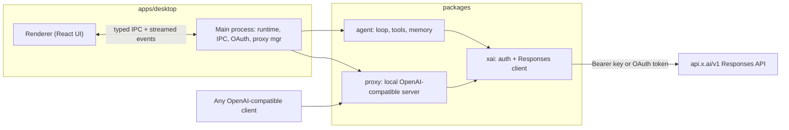
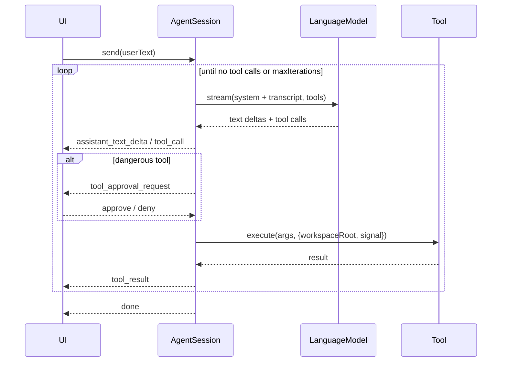

# Architecture

Ion is an npm-workspaces monorepo. The desktop app hosts the agent
runtime in Electron's main process and renders a React UI; the heavy lifting
lives in three provider-agnostic packages.

## Packages

### `packages/agent`
Provider-agnostic harness. Knows nothing about xAI.

- `types.ts` — domain types: `ConversationItem`, `ToolDef`, `ModelEvent`, and the
  `LanguageModel` interface that any provider implements.
- `loop.ts` — `AgentSession`, which drives one turn: stream assistant output,
  collect tool calls, gate dangerous ones behind approval, execute, append
  results, and repeat until the model stops or `maxIterations` is hit.
- `tools/` — the tool registry and implementations. Every file/terminal path is
  validated against the workspace root (`tools/paths.ts`).
- `mcp.ts` / `mcp-client.ts` — load Cursor-style `mcp.json`, spawn stdio /
  HTTP servers, wrap their tools as `mcp_*` (same approval as the terminal).
- `memory.ts` — `SessionStore`, one JSON file per conversation.
- `checkpoints.ts` / `diff.ts` — snapshot files before `write_file` /
  `edit_file`, emit a `turn_changes` review card, restore on demand.
  Checkpoint items live on the transcript but are stripped before the
  model sees them.
- `events.ts` — the `AgentEvent` union streamed to the UI.

### `packages/xai`
The auth layer and the model client.

- `client.ts` — `XaiModelClient` implements `LanguageModel` against the Responses
  API (`POST /v1/responses`, SSE streaming, function calling) and translates
  domain items to/from the wire format.
- `auth/` — a `Credentials` interface with two implementations:
  - `ApiKeyCredentials` — static bearer token.
  - `OAuthCredentials` — device-flow tokens with serialized, rotating refresh.
- `sse.ts` — a spec-compliant Server-Sent Events parser.

### `packages/proxy`
An optional local OpenAI-compatible HTTP server (`server.ts`) plus a headless CLI
(`cli.ts`). It injects the active bearer token and forwards to xAI, translating
`/v1/chat/completions` into a Responses request.

## Desktop wiring (`apps/desktop/src/main`)

- `config.ts` — file-backed app config (`~/.ion/config.json`).
- `auth.ts` — `AuthManager` resolves `Credentials` for the active mode.
- `oauth.ts` — runs the device flow, opens the browser, streams progress.
- `runtime.ts` — `AgentRuntime` owns live `AgentSession`s, forwards their events
  to the renderer over IPC, and bridges approval decisions back.
- `proxy.ts` — start/stop lifecycle for the local proxy.
- `ipc.ts` — registers all IPC handlers.

The renderer talks to the main process only through the typed bridge in
`src/preload/index.ts`, whose surface is defined in `src/shared/ipc.ts`.

## The agent loop

## Event streaming

`AgentSession` emits `AgentEvent`s to a callback. `AgentRuntime` forwards each one
to the renderer as `{ sessionId, event }`, and the renderer's store folds them
into a `UiItem[]` transcript (messages, tool cards, errors). Because events carry
the `sessionId`, only the active session updates the visible thread.
