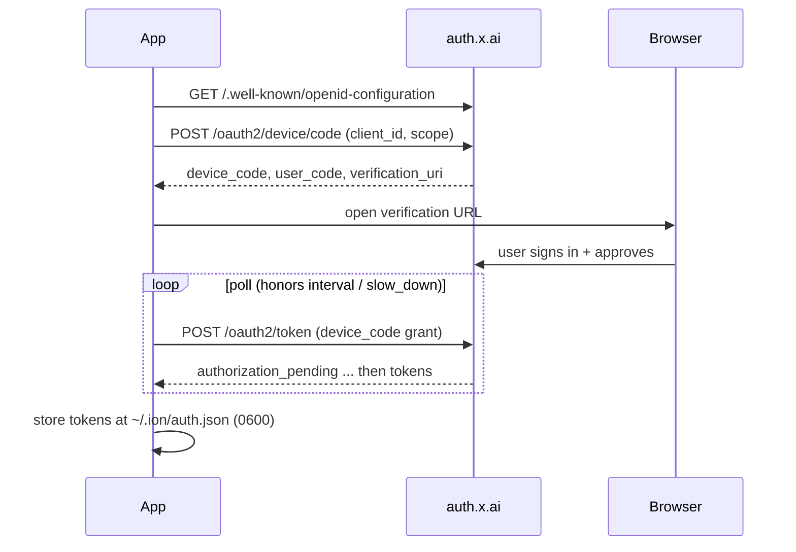

# Authentication

Ion supports two independent auth methods. The agent and the proxy both
depend only on a small `Credentials` interface, so nothing in the codebase
branches on _how_ a token was obtained.

```ts
interface Credentials {
  kind: 'api_key' | 'oauth'
  authorizationHeader(): Promise<string>      // "Bearer <token>"
  handleUnauthorized?(): Promise<boolean>      // refresh + retry-once hint
}
```

## Option 1 — xAI API key (pay-per-token)

1. Create a key at [console.x.ai](https://console.x.ai).
2. In the app: **Customize -> Settings -> API key**, paste it, and **Save**.
   - Or set the `XAI_API_KEY` environment variable for the headless proxy.
3. The key is written to `~/.ion/config.json` with `0600` permissions and
   is never exposed to the renderer (the UI only learns whether a key is set).

Billing is per-token on your xAI account.

## Option 2 — SuperGrok OAuth (subscription)

Uses your existing **SuperGrok** or **X Premium+** subscription via a browser-based
OAuth 2.0 **device-code** flow — no API key required.

### Flow



- **Provider constants** (public, not secrets): issuer `https://auth.x.ai`,
  client ID `b1a00492-073a-47ea-816f-4c329264a828`, scope
  `openid profile email offline_access grok-cli:access api:access`. These match
  the values the open-source Hermes agent uses for the same flow.
- **Endpoint validation:** every discovered endpoint must be HTTPS on the `x.ai`
  origin (or a `*.x.ai` subdomain). A poisoned discovery document cannot redirect
  token traffic off-origin. See `validateXaiEndpoint` in
  [packages/xai/src/auth/oidc.ts](../packages/xai/src/auth/oidc.ts).

### Token storage and refresh

- Tokens are stored only at `~/.ion/auth.json` (`0600`, atomic writes).
- Access tokens are short-lived. Refresh happens **proactively** based on the JWT
  `exp` claim (with a safety skew) and **reactively** on a `401`.
- xAI **rotates the refresh token on every refresh**. To avoid spending a
  single-use refresh token twice, refreshes are collapsed into one in-flight
  operation and the rotated pair is persisted atomically _before_ the new access
  token is handed out. See `OAuthCredentials` in
  [packages/xai/src/auth/oauth.ts](../packages/xai/src/auth/oauth.ts).

### Known caveat: HTTP 403 tier-gating

xAI enforces its own allowlist on the OAuth API surface. Some SuperGrok accounts
sign in successfully in the browser but then receive **HTTP 403** on inference,
even with an active subscription.

Ion handles this explicitly: a 403 during refresh stops the retry loop,
flags the account as tier-gated, and surfaces a clear message suggesting the
API-key path instead. It does not silently loop. Switch to **API key** mode in
Settings if you hit this.

## Switching modes

The active mode is stored in config and selected in Settings. Changing it (or the
key/tokens) invalidates cached agent sessions so the next message uses the new
credentials. API-key-only usage never touches the OAuth code paths, and vice
versa.
